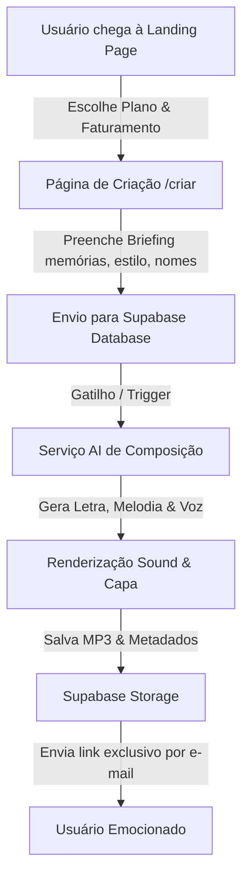

# ✦ CantataIA — Músicas Personalizadas com Inteligência Artificial

<div align="center">
  
  <p><em>Transforme suas histórias e memórias mais profundas em canções personalizadas e inesquecíveis geradas por IA.</em></p>

  [](https://vite.dev/)
  [](https://react.dev/)
  [](https://tailwindcss.com/)
  [](https://www.typescriptlang.org/)
  [](https://tanstack.com/router/latest)
</div>

---

## 🎨 O Projeto & Nova Experiência Premium

O **CantataIA** é um serviço inovador que traduz sentimentos humanos e momentos especiais (aniversários, casamentos, dia das mães, pedidos de namoro) em composições musicais de altíssimo nível artístico. 

Recentemente, a landing page foi reestruturada para alcançar uma estética **DTC ultra-premium**, aplicando padrões de design moderno, micro-animações fluidas e interatividade refinada.

### 🌟 Principais Recursos e Melhorias Visuais

#### 1. Hero Section & Tipografia Avançada
* **Headline Display**: Ajustado com `font-feature-settings: "ss01"` ( Plus Jakarta Sans estilizado ) e espaçamento entre letras reduzido para `-0.03em` para um visual elegante e editorial.
* **Micro-animações Sequenciais**: Entrada de conteúdos da esquerda com efeito gradual `fadeInUp` sincronizado por delays milimétricos.
* **Glassmorphism de Alta Fidelidade**: O `MusicCard` do player utiliza uma borda gradiente cromática (`rgba(124, 58, 237, 0.35)` a `rgba(236, 72, 153, 0.18)`), fundo semitransparente em desfoque de `24px` e flutuação amortecida para não sobrecarregar a visualização do usuário.

#### 2. Music Player Interativo Avançado
* **Controles Robustos**: Substituição de emojis por ícones SVG vetoriais consistentes da biblioteca `lucide-react`.
* **Funções de Fita**: Adicionados controles de **Volume Slider** intuitivo, botão rápido de **Mute**, seletores visuais de **Shuffle (Aleatório)** e **Repeat (Repetição)**.
* **Reflexo Premium**: O card projeta uma sombra espelhada realista logo abaixo (`scaleY(-1)`) simulando uma superfície vitrificada premium.
* **Assets Exclusivos**: Três novas artes gerativas temáticas (`romance`, `passion`, `anniversary`) foram desenvolvidas sob medida integrando o gradiente da marca.

#### 3. Seção de Planos com Faturamento Dinâmico
* **Toggle de Faturamento**: Seletor intuitivo entre o ciclo **Mensal / Anual** aplicando **20% de desconto** nas opções anuais de forma automática e dinâmica no lado do cliente.
* **Glow Card do Plano Favorito**: O plano "Completa" se destaca com uma borda cromática pulsante animada (`@keyframes borderGlow`) que cicla por tons de violeta, rosa e âmbar.
* **Ícones Contextualizados**: Ícones específicos da biblioteca Lucide para cada feature listada (ex: `Music2` para faixas, `FileText` para PDFs, `Zap` para entrega expressa e `MessageSquare` para suporte VIP).

#### 4. Depoimentos & Carrossel Suave
* **Avatares com Iniciais**: Placeholders circulares minimalistas com as iniciais do cliente aplicadas sobre gradientes dinâmicos sutis.
* **Auto-scroll Mobile**: Carrossel horizontal deslizante suave que move automaticamente os cards no mobile com temporizador de auto-reinício pós-interação.
* **Datas Relativas**: Marcação de tempo sutis (ex: `"há 2 dias"`) para credibilidade.

#### 5. Acessibilidade & Contraste
* **Acento Secundário**: Inserção do tom Amber (`#F59E0B`) para realçar elementos secundários, pontuações e estrelas.
* **Contraste WCAG AA**: Elevação do contraste dos textos secundários (`text-[#4C4B63]`) passando com folga na razão mínima de contraste de 4.5:1.
* **prefers-reduced-motion**: Respeito automático a usuários com sensibilidade a movimentos, desabilitando keyframes e transições caso o sistema operacional possua esta diretiva ativa.

---

## 🏗️ Arquitetura do Sistema & Fluxo de Dados

A aplicação utiliza o **TanStack Router** para roteamento de alto desempenho e controle estrito de tipos, associado à biblioteca **React Query** para gerenciamento de cache de dados e sincronização de chamadas de API.



---

## 📁 Estrutura de Pastas

```text
├── .tanstack/             # Cache e arquivos internos de tipagem do TanStack Router
├── src/
│   ├── assets/            # Imagens gerativas temáticas, logos e backgrounds
│   ├── components/
│   │   ├── site-chrome.tsx# Componentes de moldura global (SiteHeader, SiteFooter)
│   │   └── ui/            # Elementos de interface reutilizáveis (Sonner, etc.)
│   ├── lib/
│   │   └── plans.ts       # Declaração dos dados dos planos do CantataIA
│   ├── routes/
│   │   ├── __root.tsx     # Shell principal e configuração de Head HTML global
│   │   ├── index.tsx      # A Landing Page Premium do CantataIA (Foco das melhorias)
│   │   ├── criar.tsx      # Fluxo de briefing e criação da música com IA
│   │   └── sucesso.tsx    # Tela de confirmação e entrega
│   ├── styles.css         # Configurações de tokens, OKLCH, Tailwind 4 e animações globais
│   └── main.tsx           # Ponto de entrada do React
├── package.json           # Dependências e scripts npm
├── vite.config.ts         # Configurações do Vite e plugins SSR/TanStack
└── tsconfig.json          # Configuração estrita do compilador TypeScript
```

---

## 🎨 Guia de Estilo & Tokens Visuais (Design System)

A paleta de cores principal é inspirada na identidade **LoveTune**, utilizando a paleta cromática moderna baseada no espaço de cores perceptual **OKLCH**:

* **Background**: `oklch(0.99 0.006 300)` (Fundo lavanda ultra claro/quase branco).
* **Text Foreground**: `oklch(0.20 0.03 285)` (Tinta escura de alto contraste).
* **Text Auxiliar (Muted)**: `text-[#4C4B63]` (Roxo ardósia de alto contraste em WCAG AA).
* **Primary Accent**: `oklch(0.55 0.25 295)` (Violeta vibrante para marcação principal).
* **Secondary Accent**: `oklch(0.66 0.22 350)` (Pink magenta brilhante para realce).
* **Acento Terciário (Highlight)**: `#F59E0B` (Âmbar quente para destaques secundários e estrelas de avaliação).
* **Gradiente da Marca** (`bg-gradient-hero`):
  ```css
  linear-gradient(135deg, oklch(0.55 0.25 295) 0%, oklch(0.62 0.24 320) 55%, oklch(0.66 0.22 350) 100%)
  ```

---

## 🛠️ Instalação e Execução Local

Para rodar o projeto localmente em sua máquina, certifique-se de ter o [Node.js](https://nodejs.org/) instalado e siga as instruções abaixo:

### 1. Clonar o repositório
```bash
git clone https://github.com/seu-usuario/melody-maker-magic-53.git
cd melody-maker-magic-53
```

### 2. Instalar dependências
O projeto é otimizado para o instalador ultra-rápido **Bun**, mas você também pode utilizar npm ou yarn:
```bash
bun install
# ou
npm install
```

### 3. Rodar Servidor de Desenvolvimento
Inicie o servidor local integrado do Vite:
```bash
bun run dev
# ou
npm run dev
```
Abra o navegador em [http://localhost:5173](http://localhost:5173).

### 4. Compilar para Produção (Build)
Gere o pacote otimizado e minificado pronto para deployment na Vercel ou Netlify:
```bash
bun run build
# ou
npm run build
```

---

## ⚡ Tecnologias Adicionais Utilizadas

* **Vite + React 19**
* **TypeScript**
* **Lucide React** (Ícones vetoriais modernos)
* **TanStack Start / React Router**
* **TailwindCSS v4** (Com injeção direta de OKLCH e variáveis dinâmicas)
* **Nitro** (SSR bundling avançado)
